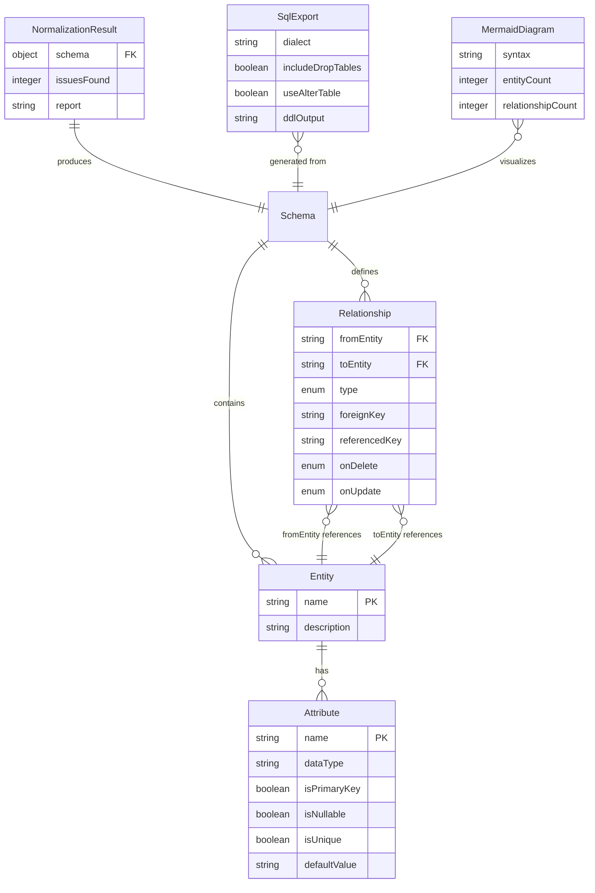

# DesignDB — Version Control & Patch Notes

> **Project:** DesignDB — AI-Integrated Relational Database Designer  
> **Repository:** `d:\antigravtiy`  
> **Stack:** Next.js 14 · React 18 · TypeScript · Tailwind CSS · React Flow · Groq (Llama 3.3 70B) · Dagre · Mermaid.js · Zod  
> **Last Updated:** 2026-04-26

---

## Table of Contents

1. [Release History (Patch Notes)](#release-history)
2. [ERD Submission — Project Schema](#erd-submission--project-schema)
3. [Relational Database Schema Description](#relational-database-schema-description)
4. [How to Tackle the ERD Submission](#how-to-tackle-the-erd-submission)

---

## Release History

### v0.1.0 — Foundation & Architecture Setup

> Initial project scaffolding and backend execution pipeline.

| #  | Area      | Feature                                  | Description                                                                                         | Key Files                                                          |
|----|-----------|------------------------------------------|-----------------------------------------------------------------------------------------------------|--------------------------------------------------------------------|
| 1  | Backend   | Project Scaffolding                      | Monorepo structure with `execution/`, `directives/`, `frontend/`, `.tmp/` directories               | `package.json`, `tsconfig.json`, `AGENTS.md`                       |
| 2  | Backend   | Schema Validator (Zod)                   | Strict type-safe validation of AI-generated schemas using Zod schemas for Entity, Attribute, Relationship | `execution/utils/schema_validator.ts`                              |
| 3  | Backend   | Logger Utility                           | Structured logging system for all pipeline stages (info, warning, error)                            | `execution/utils/logger.ts`                                        |
| 4  | Backend   | Requirements Analyzer (Gemini)           | LLM-powered entity/attribute extraction using Google Gemini 1.5 Flash with JSON response mode       | `execution/analyse_requirements.ts`                                |
| 5  | Backend   | 3NF Normalization Engine                 | Deterministic multi-pass normalization (1NF → 2NF → 3NF) with auto-decomposition and reporting     | `execution/normalize_schema.ts`                                    |
| 6  | Backend   | Mermaid.js Diagram Generator             | Converts normalized JSON schemas to Mermaid ER diagram syntax with cardinality notation              | `execution/generate_mermaid.ts`                                    |
| 7  | Backend   | Multi-Dialect SQL Export                 | DDL generation for PostgreSQL, MySQL, SQLite with topological sort, FK constraints, reserved word escaping | `execution/export_sql.ts`                                          |
| 8  | Backend   | End-to-End Pipeline Test                 | Full pipeline test: prompt → analysis → normalization → mermaid → SQL                               | `execution/test_pipeline.ts`                                       |
| 9  | Directive | Requirements Analysis SOP                | 19KB directive covering entity extraction workflows, edge cases, and prompt patterns                 | `directives/analyze_requirements.md`                               |
| 10 | Directive | Table Generation SOP                     | Directive for SQL table creation guidelines and dialect-specific rules                               | `directives/generate_tables.md`                                    |
| 11 | Directive | Normalization SOP                        | Directive covering 1NF/2NF/3NF validation workflows and decomposition strategies                     | `directives/normalize_database.md`                                 |

---

### v0.2.0 — Frontend Foundation & Landing Page

> Premium landing page with animated background and prompt input system.

| #  | Area     | Feature                               | Description                                                                                                  | Key Files                                              |
|----|----------|---------------------------------------|--------------------------------------------------------------------------------------------------------------|--------------------------------------------------------|
| 12 | Frontend | Next.js 14 App Router Setup           | Full Next.js 14 project with App Router, TypeScript, Tailwind CSS, dark mode enforced                        | `frontend/src/app/layout.tsx`, `frontend/package.json` |
| 13 | Frontend | Custom Design System (Tailwind)       | Complete design token system: sentry-purple, lime-green, coral-accent, ghost-border, custom shadows, HSL CSS vars | `frontend/tailwind.config.ts`, `globals.css`           |
| 14 | Frontend | Custom Typography (Vagnola)           | Self-hosted Vagnola font face with `@font-face` declaration and Tailwind font-family integration             | `globals.css`, `frontend/src/app/fonts/`               |
| 15 | Frontend | Vanta.js Animated Background          | Three.js-powered interactive fog effect with custom blue palette (highlight, midtone, lowlight, base)        | `components/Home/VantaBackground.tsx`                  |
| 16 | Frontend | Home Page Hero Section                | Landing page with gradient title ("Design**DB**"), subtitle, radial vignette overlay                         | `frontend/src/app/page.tsx`                            |
| 17 | Frontend | AI Prompt Input Box                   | Glassmorphic textarea with rotating placeholder prompts, keyboard shortcut (⌘+Enter), validation glow       | `components/Home/PromptBox.tsx`                        |
| 18 | Frontend | Quick Example Chips                   | One-click preset buttons (E-commerce, SaaS Platform, Hospital DB, Social App) that auto-fill prompts        | `components/Home/PromptBox.tsx`                        |
| 19 | Frontend | Home Navbar                           | Frosted-glass navbar with SVG logo, nav links (Docs, Examples, Pricing), GitHub link, "Open Canvas" CTA     | `components/Home/HomeNavbar.tsx`                       |
| 20 | Frontend | Canvas Loader Transition              | Full-screen white overlay with animated SVG polyline heartbeat + "DesignDB" wordmark, timed fade-out         | `components/Home/CanvasLoader.tsx`                     |
| 21 | Frontend | SEO Metadata                          | Proper `<title>` and `<meta description>` tags for both Home and Canvas pages                                | `page.tsx`, `layout.tsx`                               |

---

### v0.3.0 — AI Integration & API Pipeline

> Groq-powered Llama 3.3 backend replacing Gemini, with prompt engineering and schema mutation.

| #  | Area     | Feature                                   | Description                                                                                                | Key Files                                                    |
|----|----------|-------------------------------------------|------------------------------------------------------------------------------------------------------------|--------------------------------------------------------------|
| 22 | AI       | Groq SDK Integration (Llama 3.3 70B)      | Migrated from Google Gemini to Groq cloud for Llama 3.3 70B Versatile with `json_object` response format   | `frontend/src/lib/execution/analyse_requirements.ts`         |
| 23 | AI       | System Prompt Engineering                  | Expert database architect system prompt with strict JSON schema spec, snake_case rules, 8 normalization rules | `frontend/src/lib/execution/prompts.ts`                      |
| 24 | AI       | Few-Shot Learning Examples                 | Curated e-commerce example (customer → order → product) demonstrating expected output structure             | `frontend/src/lib/execution/prompts.ts`                      |
| 25 | AI       | Schema Mutation / Iterative Editing        | Context-aware schema modifications — LLM receives existing schema + user modification prompt for delta updates | `frontend/src/lib/execution/analyse_requirements.ts`         |
| 26 | Backend  | Next.js API Route (`/api/generate`)        | Server-side 4-stage pipeline: analyze → normalize → mermaid → SQL, returns full schema + report            | `frontend/src/app/api/generate/route.ts`                     |
| 27 | Backend  | Frontend Normalization Engine              | Duplicated and optimized 3NF engine for Next.js server-side execution with 1NF repeating group extraction  | `frontend/src/lib/execution/normalize_schema.ts`             |
| 28 | Backend  | Frontend SQL Export Engine                 | Duplicated multi-dialect DDL generator optimized for server-side with topological sort + cyclic detection   | `frontend/src/lib/execution/export_sql.ts`                   |
| 29 | Backend  | Frontend Mermaid Generator                 | Duplicated Mermaid ER syntax generator for server-side rendering                                           | `frontend/src/lib/execution/generate_mermaid.ts`             |
| 30 | Backend  | Zod Schema Validation (Frontend)           | Shared Zod schemas (Entity, Attribute, Relationship, Database) for runtime validation of AI outputs        | `frontend/src/lib/execution/utils/schema_validator.ts`       |

---

### v0.4.0 — Interactive ERD Canvas Engine

> Full visual ERD canvas with React Flow, Dagre layout, and custom node/edge rendering.

| #  | Area     | Feature                                      | Description                                                                                                   | Key Files                                            |
|----|----------|----------------------------------------------|---------------------------------------------------------------------------------------------------------------|------------------------------------------------------|
| 31 | Frontend | React Flow Canvas                            | Full interactive graph canvas with dark mode, dot-grid background, zoom/pan controls                          | `components/Canvas/Canvas.tsx`                       |
| 32 | Frontend | Dagre Hierarchical Layout Engine             | Automatic Left-to-Right DAG layout with `nodesep: 80`, `ranksep: 350`, dynamic height calculation per node    | `components/Canvas/Canvas.tsx` (getLayoutedElements) |
| 33 | Frontend | Custom TableNode Component                   | Glassmorphic table cards showing entity name, icon, PK/FK/regular attributes with color-coded type badges     | `components/Canvas/Nodes/TableNode.tsx`              |
| 34 | Frontend | Dynamic FK Attribute Highlighting            | Hover a FK attribute → resolves target table dynamically → highlights edge + target PK with glow effects      | `components/Canvas/Nodes/TableNode.tsx`              |
| 35 | Frontend | HoverContext (Cross-Component State)         | React Context provider syncing hover state across TableNodes, CrowsFootEdge, and PulseEdge components         | `components/Canvas/HoverContext.tsx`                 |
| 36 | Frontend | Crow's Foot Edge Notation                    | Industry-standard cardinality markers (||, o{) via SVG `<marker>` definitions for 1:1, 1:N, N:1, M:N         | `components/Canvas/Edges/CrowsFootEdge.tsx`          |
| 37 | Frontend | Pulse Edge (Animated Heartbeat)              | Bezier curve edges with traveling SVG `<circle>` spark animation + dashed stroke on hover                     | `components/Canvas/Edges/PulseEdge.tsx`              |
| 38 | Frontend | Staggered Graph Reveal Animation             | Nodes revealed one-by-one (150ms intervals) synced with progress bar 50% → 100%, then edges after all nodes  | `components/Canvas/Canvas.tsx`                       |
| 39 | Frontend | Synchronized Progress Overlay                | Two-phase progress: "Synthesizing Schema" (0–50%, API) → "Rendering Architecture" (50–100%, stagger)         | `components/Canvas/Canvas.tsx`                       |
| 40 | Frontend | Auto Fit-View on Render                      | `rfInstance.fitView()` called dynamically during stagger + final 800ms smooth zoom to fit                     | `components/Canvas/Canvas.tsx`                       |

---

### v0.5.0 — Canvas UI Panels & Workspace Chrome

> Complete workspace shell with floating header, sidebar, dock, and iterative command bar.

| #  | Area     | Feature                                   | Description                                                                                             | Key Files                                       |
|----|----------|-------------------------------------------|---------------------------------------------------------------------------------------------------------|-------------------------------------------------|
| 41 | Frontend | Floating Header Bar                       | Top toolbar with DesignDB logo, Home navigation, Grid/Edit mode icons, progress counter, Play/Share CTAs | `components/Canvas/FloatingHeader.tsx`           |
| 42 | Frontend | Right Sidebar (Node Library)              | Component library panel: Creation (Inputs, Transform, Database), Visuals (Styles), Typography, Theme swatches | `components/Canvas/RightSidebar.tsx`             |
| 43 | Frontend | Floating Dock (Bottom-Left)               | macOS-style animated dock with Components, Layouts, Data Types, Relationships, Mappings icons            | `components/ui/floating-dock.tsx`                |
| 44 | Frontend | Iterative Command Bar                     | Bottom-center AI prompt bar for schema mutations (e.g., "Add an audit log table") with loading states    | `components/Canvas/IterativeCommandBar.tsx`      |
| 45 | Frontend | Bottom Panel (SQL Code View)              | Collapsible SQL code viewer showing generated DDL with monospace font, READ ONLY badge                   | `components/Canvas/BottomPanel.tsx`              |
| 46 | Frontend | Bottom Panel (Reviews / Insights)         | Collapsible AI insight panel showing normalization status and intelligence badge                          | `components/Canvas/BottomPanel.tsx`              |
| 47 | Frontend | Magnetic Button Effect                    | Subtle cursor-follow magnetic animation on interactive buttons (Add Attribute, Play button)              | `components/Canvas/Magnetic.tsx`                 |
| 48 | Frontend | Glassmorphism Design System               | Reusable CSS classes: `.glass-panel`, `.node-panel`, `.node-panel-active`, `.ethereal-panel`             | `globals.css`                                   |
| 49 | Frontend | Custom Scrollbar Styling                  | Themed scrollbars (`.p-scrollbar`) with transparent track and translucent white thumb                    | `globals.css`                                   |
| 50 | Frontend | Animated Border Spin Effect               | Conic-gradient rotating border utility (`.animated-panel-border`) for highlighted panels                 | `globals.css`                                   |

---

### v0.6.0 — Iterative AI Schema Editing

> Live schema mutation workflow — modify existing ERDs via natural language.

| #  | Area     | Feature                                         | Description                                                                                      | Key Files                                       |
|----|----------|--------------------------------------------------|--------------------------------------------------------------------------------------------------|-------------------------------------------------|
| 51 | AI       | Contextual Schema Mutations                      | Iterative prompts receive full existing schema context — LLM applies delta changes without destructive removal | `Canvas.tsx`, `analyse_requirements.ts`          |
| 52 | Frontend | Flash-Update on Mutation                         | Schema mutations skip stagger animation — graph re-renders instantly + 800ms fitView for snappy UX | `Canvas.tsx`                                     |
| 53 | Frontend | Session Storage Prompt Relay                     | Prompt saved to `sessionStorage` on home page → consumed on canvas page for seamless page transition | `PromptBox.tsx`, `Canvas.tsx`                    |
| 54 | Backend  | Pipeline Error Surfacing                         | API errors propagated with descriptive messages to the canvas SQL panel for user-visible debugging | `route.ts`, `Canvas.tsx`                         |

---

## ERD Submission — Project Schema

> This is the ER Diagram of DesignDB's **internal conceptual data model** — the schema that DesignDB itself operates on at runtime.

---

## Relational Database Schema Description

> DesignDB is a **client-side AI application** — it does not persist data to a traditional RDBMS. Instead, the "database" is a **runtime JSON schema** validated by Zod and held in React state. Below is the formal relational description of the data structures the application processes.

### Tables, Attributes, Keys & Relationships

#### Table: `Entity`

| Attribute     | Data Type      | Key     | Nullable | Unique | Description                        |
|---------------|----------------|---------|----------|--------|------------------------------------|
| `name`        | VARCHAR(255)   | **PK**  | No       | Yes    | Unique entity/table name           |
| `description` | TEXT           | —       | Yes      | No     | Brief description of the entity    |

---

#### Table: `Attribute`

| Attribute      | Data Type      | Key     | Nullable | Unique | Description                          |
|----------------|----------------|---------|----------|--------|--------------------------------------|
| `name`         | VARCHAR(255)   | **PK**  | No       | No     | Column name within parent entity     |
| `entity_name`  | VARCHAR(255)   | **FK**  | No       | No     | References `Entity.name`             |
| `dataType`     | VARCHAR(100)   | —       | No       | No     | SQL data type (INTEGER, VARCHAR, etc)|
| `isPrimaryKey` | BOOLEAN        | —       | No       | No     | Whether this is a primary key        |
| `isNullable`   | BOOLEAN        | —       | No       | No     | Whether NULL values are allowed      |
| `isUnique`     | BOOLEAN        | —       | No       | No     | Whether a UNIQUE constraint applies  |
| `defaultValue` | VARCHAR(255)   | —       | Yes      | No     | Default value expression             |

> **Composite PK:** (`entity_name`, `name`)  
> **FK:** `entity_name` → `Entity.name` (CASCADE / CASCADE)

---

#### Table: `Relationship`

| Attribute       | Data Type                                  | Key    | Nullable | Unique | Description                              |
|-----------------|--------------------------------------------|--------|----------|--------|------------------------------------------|
| `id`            | INTEGER (auto)                             | **PK** | No       | Yes    | Surrogate identifier                     |
| `fromEntity`    | VARCHAR(255)                               | **FK** | No       | No     | Child entity — References `Entity.name`  |
| `toEntity`      | VARCHAR(255)                               | **FK** | No       | No     | Parent entity — References `Entity.name` |
| `type`          | ENUM('one-to-one','one-to-many','many-to-one','many-to-many') | — | No | No | Cardinality type                    |
| `foreignKey`    | VARCHAR(255)                               | —      | No       | No     | FK attribute name in `fromEntity`        |
| `referencedKey` | VARCHAR(255)                               | —      | No       | No     | PK attribute name in `toEntity`          |
| `onDelete`      | ENUM('CASCADE','SET NULL','RESTRICT','NO ACTION') | —  | No       | No     | Referential delete action                |
| `onUpdate`      | ENUM('CASCADE','RESTRICT','NO ACTION')     | —      | No       | No     | Referential update action                |

> **FK:** `fromEntity` → `Entity.name` (RESTRICT / CASCADE)  
> **FK:** `toEntity` → `Entity.name` (RESTRICT / CASCADE)

---

#### Table: `NormalizationResult`

| Attribute     | Data Type | Key    | Nullable | Description                                  |
|---------------|-----------|--------|----------|----------------------------------------------|
| `id`          | INTEGER   | **PK** | No       | Surrogate identifier                         |
| `schema_ref`  | JSON      | —      | No       | Snapshot of the normalized Schema object      |
| `issuesFound` | INTEGER   | —      | No       | Count of normalization anomalies resolved     |
| `report`      | TEXT      | —      | No       | Markdown-formatted normalization report       |

---

#### Table: `SqlExport`

| Attribute          | Data Type                       | Key    | Nullable | Description                           |
|--------------------|---------------------------------|--------|----------|---------------------------------------|
| `id`               | INTEGER                         | **PK** | No       | Surrogate identifier                  |
| `dialect`          | ENUM('postgres','mysql','sqlite')| —     | No       | Target SQL dialect                    |
| `includeDropTables`| BOOLEAN                         | —      | No       | Whether DROP TABLE statements included|
| `useAlterTable`    | BOOLEAN                         | —      | No       | Whether FKs use ALTER TABLE           |
| `ddlOutput`        | TEXT                            | —      | No       | Generated DDL SQL string              |

---

### Relationship Summary

| From Entity          | To Entity   | Cardinality | Foreign Key     | Referenced Key | On Delete | On Update |
|----------------------|-------------|-------------|-----------------|----------------|-----------|-----------|
| `Attribute`          | `Entity`    | Many-to-One | `entity_name`   | `name`         | CASCADE   | CASCADE   |
| `Relationship`       | `Entity`    | Many-to-One | `fromEntity`    | `name`         | RESTRICT  | CASCADE   |
| `Relationship`       | `Entity`    | Many-to-One | `toEntity`      | `name`         | RESTRICT  | CASCADE   |
| `NormalizationResult`| `Schema`    | One-to-One  | `schema_ref`    | (embedded)     | —         | —         |
| `SqlExport`          | `Schema`    | Many-to-One | (derived)       | (embedded)     | —         | —         |

---

## How to Tackle the ERD Submission

> [!IMPORTANT]
> **Your project (DesignDB) dynamically generates ERDs for users — it doesn't have a traditional persistent database.** Here's the recommended strategy for your submission:

### Recommended Approach

Since DesignDB is an **AI-powered ERD generator** that produces custom schemas from user prompts, you should submit **two things**:

#### 1. The Project's Own Internal Schema ERD (Above ☝️)
This is the **data model that DesignDB processes at runtime** — the Zod-validated JSON schema structure (`Entity`, `Attribute`, `Relationship`). This represents the "database" your application conceptually operates on, even though it's held in-memory rather than persisted to an RDBMS.

**How to export it:**
- Copy the Mermaid diagram above → paste into [Mermaid Live Editor](https://mermaid.live) → export as **PNG/SVG**
- Or use [draw.io](https://draw.io) to manually recreate it (more polished)
- Or use your own app: type *"A schema management system with entities, attributes, and relationships where entities have attributes and relationships connect two entities with cardinality"* into DesignDB and screenshot the generated ERD

#### 2. A Generated Example ERD (Proof of Capability)
Run DesignDB with a sample prompt like:
> *"Design an e-commerce system with customers, products, orders, order items, categories, and reviews"*

Screenshot the resulting React Flow canvas showing the full ERD with Crow's Foot notation. This demonstrates your project's core functionality and serves as a **second ERD artifact**.

### Submission Checklist

| Item | Tool Used | Format | Status |
|------|-----------|--------|--------|
| Project Internal Schema ERD | Mermaid Live Editor / draw.io | PNG/SVG | ☐ |
| Relational Schema Description (tables, keys, relationships) | This document | PDF/MD | ☐ |
| Example Generated ERD (app screenshot) | DesignDB Canvas | PNG screenshot | ☐ |
| SQL DDL Export (from app) | DesignDB SQL Panel | `.sql` file | ☐ |

> [!TIP]
> **For maximum marks:** Export the Mermaid diagram to PNG via [mermaid.live](https://mermaid.live), include the relational schema tables from this document, and attach a screenshot of your running canvas with a complex example (6+ tables). This covers all three bases: digital ERD tool ✓, schema description ✓, working software ✓.
